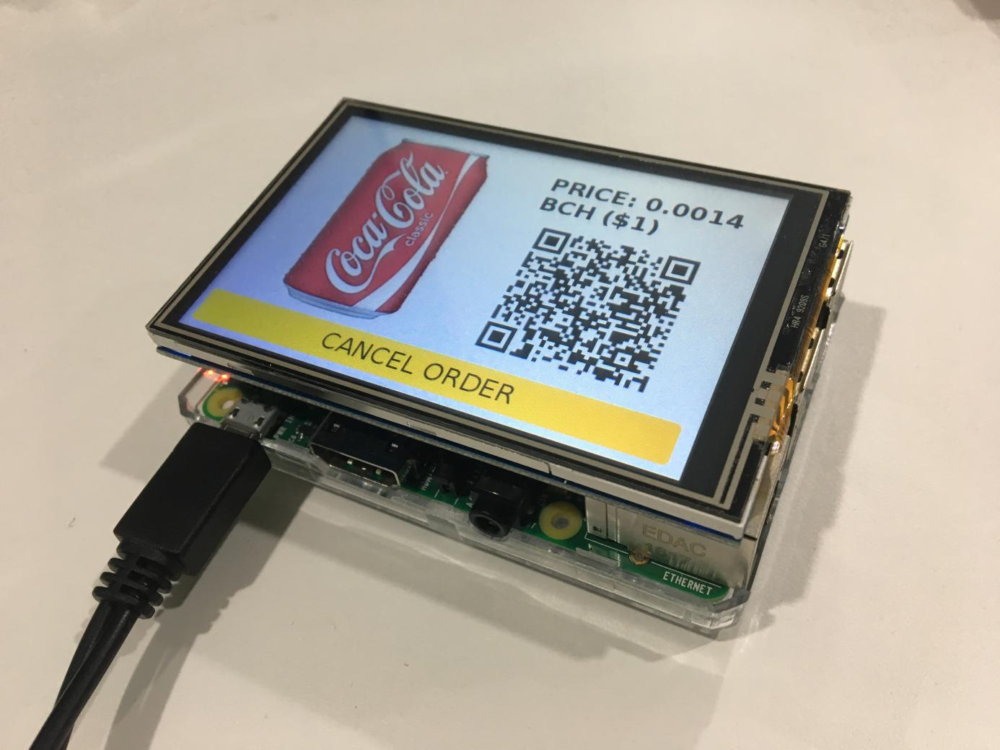

# Bitcoin (BCH) vending machine

*Bitcoin Vending Machine is a simple software that will turn your micro-computer into a fully functional vending machine.*

v0.1

[](https://www.youtube.com/watch?v=jCm6xKr1zkM)

## Installation

*Tested on several UNIX-like operating systems. Works on ARM.*

For now, this is a browser-based application which means the app is going to run on a full-screen browser.

Software requirement: this is a Python3 app. Then download the required libraries with the following command:

```shell
pip3 install -r requirements.txt
```

Start the Flask server with:

```shell
sudo python3 main.py
```

And open up 127.0.0.1:5000 in your browser.

## Todo list

- [ ] JavaScript page loader
- [ ] Check different APIs
- [ ] Display error page if no internet connection/API down

## Future improvements

- Hardware design
- Addresses generated from xpub
